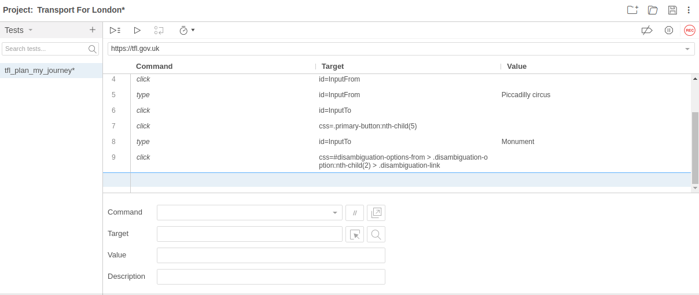
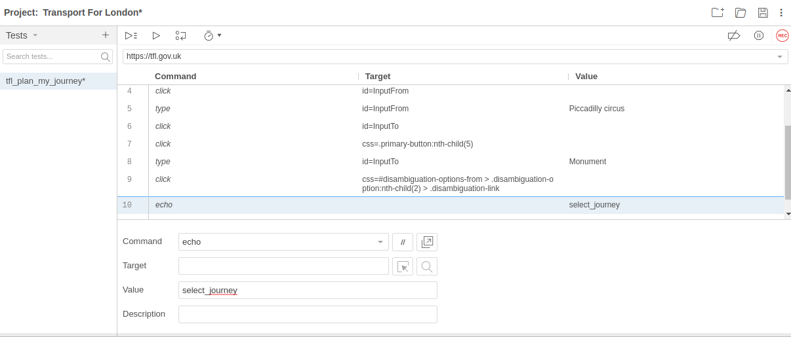

# Tanaguru scenario advanced usage

## Triggering additional audits in a scenario

Inside a given scenario, an audit is triggered each time the URL changes (e.g. when
the user clicks a links or submits a form button).

You may trigger additional audits by adding the Selenium command `echo`.

Let's enhance the [*Transport for London* example](userdoc-scenario-audit.md).
Say once we have the list of possible paths, we want to evaluate the accessibility
of the page, *showing the details of a path*.

* We complete the existing scenario. Replay the scenario already created, then click
under the last command you recorded, then press record.

* Let say we want to view the detail of the second path, and also have information
about its accessibility. 

If sent as is in Tanaguru, the result of the scenario won't show the "third page"
(precisely the detail of the path shown by the Javascript button *View Details*).
We have to add a `echo` command at the end of the scenario.

* Click under the last command recorded.
* Type *echo* in then command field
* Type the name you want Tanaguru use for this page ine field value : select_journey

* Upload the scenario to Tanaguru and launch it. You can now see a third "page" tested.

