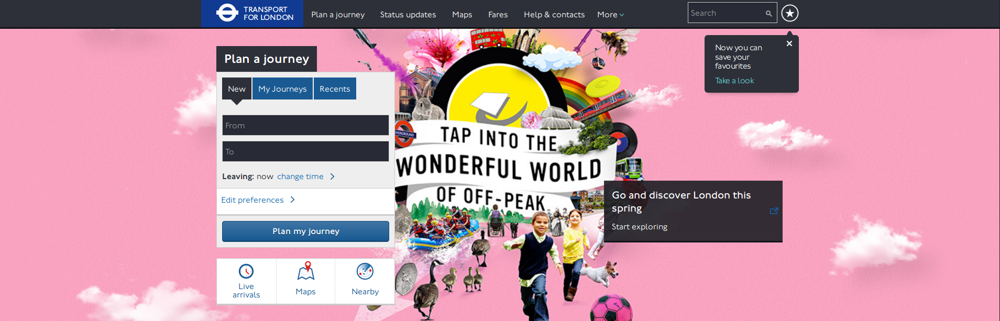
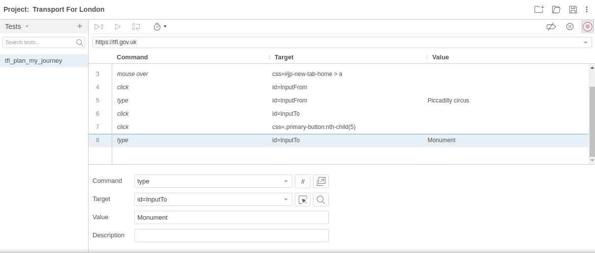
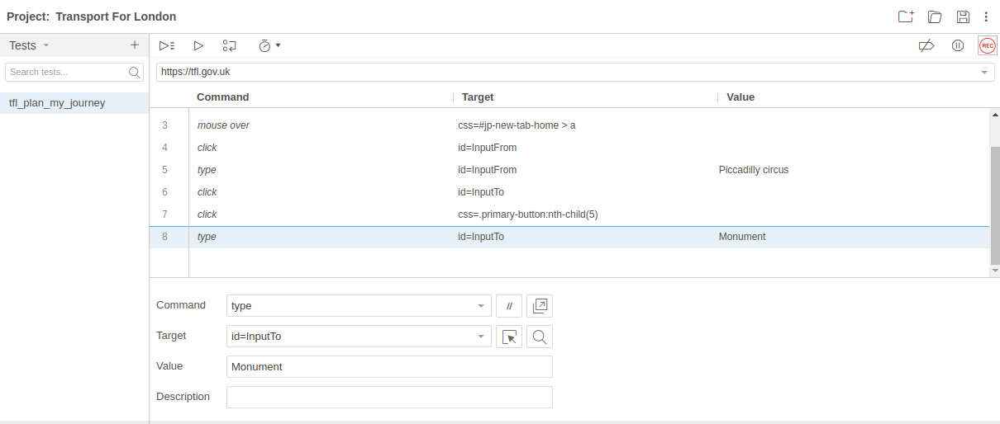

# Scenario audit of accessibility with Tanaguru

## Quick steps (for the impatient)

1. Have a Firefox and [download Selenium IDE extension](https://addons.mozilla.org/fr/firefox/addon/selenium-ide/)
1. Create your project and tests suites
1. Record your scenarios
1. Replay locally your scenarios to verify it works
1. Upload the scenario to Tanaguru
1. Run the scenario audit

## 0. Prerequesite: Firefox + SeBuilder

You need a Firefox browser with the [Selenium IDE extension](https://addons.mozilla.org/fr/firefox/addon/selenium-ide/)
to record scenarios. You can also find the extension on chrome and others browsers.

## 1. Define a scenario

Let say we are in London at *Piccadilly Circus* and want to go to *Monument*. Let
use the [Transport for London website](http://www.tfl.gov.uk/) to help us define our journey.
We want to evalutate the accessibility of the following pages:

* the homepage with the form (where we will type in our departure and arrival),
* the result page giving us the different possible paths.

Let's begin.

## 2. Record the scenario

- Open Selenium IDE
- Create new Project
- Set the project name : Transport For London
- Click on record
- Type the project base url : [http://www.tfl.gov.uk/](http://www.tfl.gov.uk/)

When you are going to press "Start Recording" your browsed will open a new window on the selected url and start recording all you actions. 

* In the *Tranport-For-London* page, fill in the *From* field (*Piccadilly circus*)
and *To* field (*Monument*)

* Click the *Plan my journey* button, and see the proposed journeys.

* In the SeBuilder window, click the *Stop recording* button:

* Enter a name for you test : tfl_plan_my_journey
* Save your project

## 3. Verify and adjust the scenario

* In the Selenium IDE window, choose Run current test

This verification is important. Tanaguru just replays the scenario, he can't check
whether or not the scenario is actually what you wanted (!).

Please refer to [Tanaguru scenario advanced usage](userdoc-scenario-audit-advanced.md)
if the scenario does not replay the way you'd like.

## 4. Upload the scenario to Tanaguru

* Log in your Tanaguru, go to your project, *Scenario Audit*

* Name your scenario, select the file and upload it

## 5. Launch the audit of the scenario

* Now run the scenario: click *Launch audit*

Eventually, set options then launch the audit.

The scenario audit is ran in *asynchronous* mode, meaning you will receive an
email when the audit is done (depending on the lenght of the audit, but typically
a few minutes).

## 6. See the results

* Go back to your project page, click on the last audit 

* You have the summary of the scenario audit. Verify which pages have been tested
by clicking on the number of pages link

(If the number of pages is not the expected one, please check [Tanaguru scenario advanced usage](userdoc-scenario-audit-advanced.md))

You may then explore the detail of each audited page.

Scenarios are a powerful tool. Once created a scenario can be executed over and
over providing also **regression testing** in addition of accessibility testing.

